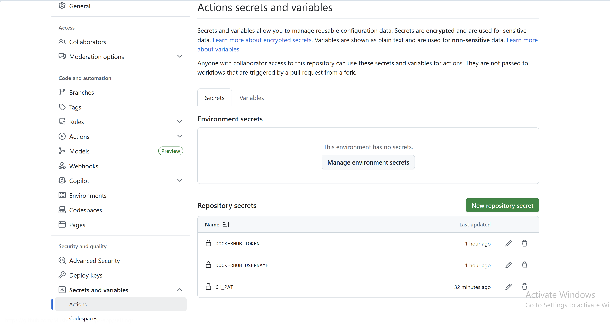

# 🔄 GitOps CI/CD Pipeline — GitHub Actions, ArgoCD & Amazon EKS


---

## 📌 Project Overview

This project implements a **production-grade GitOps pipeline** using **ArgoCD**, **GitHub Actions**, and **Amazon EKS**. It demonstrates the industry-standard pattern where Git is the single source of truth for both application code and infrastructure state.

A code push to the application repository automatically triggers a full deployment pipeline — building a Docker image, updating the Kubernetes manifest, and letting ArgoCD sync the new state to the cluster with zero manual intervention.

### Two-Repository GitOps Pattern

| Repository | Purpose |
|------------|---------|
| **gitops-app** | Application source code + Dockerfile + CI pipeline |
| **gitops-k8s-config** | Kubernetes manifests — ArgoCD watches this repo |

> Separating app code from K8s config is a GitOps best practice. It gives you a clean audit trail of every deployment, allows rollback by reverting a Git commit, and lets platform and development teams work independently.

---

## 🔄 Full Pipeline Flow

```
Developer pushes code to gitops-app (master branch)
                    │
                    ▼
         GitHub Actions triggers
                    │
          ┌─────────┴──────────┐
          │                    │
          ▼                    ▼
  Build Docker image     Run tests (optional)
          │
          ▼
  Push image to Docker Hub
  (tagged with Git commit SHA)
          │
          ▼
  Checkout gitops-k8s-config repo
          │
          ▼
  Update image tag in deployment.yaml
  (sed replaces old tag with new commit SHA)
          │
          ▼
  Commit & push updated manifest
  to gitops-k8s-config repo
          │
          ▼
  ArgoCD detects Git change
  (polls every 3 minutes)
          │
          ▼
  ArgoCD syncs manifests to EKS cluster
  (rolling update — zero downtime)
          │
          ▼
  Prometheus scrapes new pod metrics
          │
          ▼
  Grafana dashboard reflects deployment
```

---

## 🏗️ Architecture

```
┌──────────────────────────────────────────────────────────────────────┐
│                          GitHub                                        │
│                                                                        │
│  ┌─────────────────────┐         ┌──────────────────────────────┐    │
│  │    gitops-app        │         │      gitops-k8s-config        │    │
│  │                      │         │                               │    │
│  │  server.js           │  CI     │  dev/                        │    │
│  │  Dockerfile          │ updates │    deployment.yaml  ◄────────┼──┐ │
│  │  .github/workflows/  ├────────►│    service.yaml              │  │ │
│  │    deploy.yaml       │ image   │    servicemonitor.yaml       │  │ │
│  └─────────────────────┘  tag    └──────────────────────────────┘  │ │
└────────────────────────────────────────────────────────────────────┼─┘
                                                                      │
                                                           ArgoCD watches
                                                                      │
┌─────────────────────────────────────────────────────────────────────▼─┐
│                        Amazon EKS Cluster                              │
│                                                                        │
│  ┌──────────────────────────────────────────────────────────────┐    │
│  │                      argocd namespace                          │    │
│  │   ArgoCD Server — syncs Git state to cluster automatically    │    │
│  └──────────────────────────────────────────────────────────────┘    │
│                                                                        │
│  ┌──────────────────────────────────────────────────────────────┐    │
│  │                       dev namespace                            │    │
│  │   Deployment: gitops-app                                      │    │
│  │   Service: gitops-app                                         │    │
│  │   ServiceMonitor: gitops-app-monitor                          │    │
│  └──────────────────────────────────────────────────────────────┘    │
│                                                                        │
│  ┌──────────────────────────────────────────────────────────────┐    │
│  │                    monitoring namespace                        │    │
│  │   Prometheus + Grafana + Alertmanager                         │    │
│  └──────────────────────────────────────────────────────────────┘    │
└────────────────────────────────────────────────────────────────────────┘
```

---

## 🧩 Stack

| Tool | Role |
|------|------|
| **GitHub Actions** | CI pipeline — build, test, push Docker image, update manifest |
| **Docker Hub** | Container registry storing versioned application images |
| **ArgoCD** | GitOps controller — watches Git repo and syncs state to EKS |
| **Amazon EKS** | Managed Kubernetes cluster running the application |
| **eksctl** | CLI tool for provisioning and managing EKS clusters |
| **Prometheus** | Scrapes application and cluster metrics |
| **Grafana** | Visualizes metrics and deployment health |
| **prom-client** | Node.js Prometheus client library for custom metrics |

---

## ✅ Prerequisites

- AWS CLI configured with appropriate IAM permissions
- `eksctl` installed
- `kubectl` installed
- `helm` v3+ installed
- Docker installed and Docker Hub account
- GitHub account with two repositories created:
  - `gitops-app`
  - `gitops-k8s-config`

---

## 📁 Repository Structure

### Repo 1 — gitops-app
```
gitops-app/
├── server.js                        # Node.js application with prom-client
├── package.json                     # Dependencies (express, prom-client)
├── Dockerfile                       # Container build definition
├── .github/
│   └── workflows/
│       └── deploy.yaml              # GitHub Actions CI/CD pipeline
└── README.md
```

### Repo 2 — gitops-k8s-config
```
gitops-k8s-config/
├── dev/
│   ├── deployment.yaml              # Image tag auto-updated by GitHub Actions
│   ├── service.yaml                 # ClusterIP service exposing port 3000
│   └── servicemonitor.yaml          # Connects Prometheus to the app
├── argocd-app.yaml                  # ArgoCD Application resource
└── README.md
```

---

## 🚀 Deployment Steps

### Step 1 — Provision the EKS Cluster

```bash
eksctl create cluster \
  --name my-eks-cluster \
  --region us-east-1 \
  --nodegroup-name ng-1 \
  --node-type c7i-flex.large \
  --nodes 2 \
  --nodes-min 1 \
  --nodes-max 3 \
  --managed
```

**Expected output:**
```
2026-04-23 [ℹ]  building cluster stack
2026-04-23 [ℹ]  building managed nodegroup stack
2026-04-23 [✔]  EKS cluster "my-eks-cluster" in "us-east-1" region is ready
```

Verify nodes are ready:

```bash
kubectl get nodes
```

**Expected output:**
```
NAME                           STATUS   ROLES    AGE   VERSION
ip-192-168-xx-xx.ec2.internal  Ready    <none>   2m    v1.29.x
ip-192-168-xx-xx.ec2.internal  Ready    <none>   2m    v1.29.x
```

### Step 2 — Application Source Code

The Node.js application exposes custom Prometheus metrics using `prom-client`:

```javascript
// server.js
const express = require('express');
const client = require('prom-client');

const app = express();
const register = client.register;

// Default metrics (CPU, memory, event loop)
client.collectDefaultMetrics();

// Custom metric — total HTTP requests
const httpRequestsTotal = new client.Counter({
  name: 'http_request_operations_total',
  help: 'Total number of HTTP requests'
});

// Custom metric — request duration
const httpRequestDuration = new client.Histogram({
  name: 'http_request_duration_seconds',
  help: 'Duration of HTTP requests in seconds',
  buckets: [0.1, 0.5, 1, 1.5, 2, 3, 5]
});

app.get('/', (req, res) => {
  const end = httpRequestDuration.startTimer();
  const duration = Math.random() * 3;
  setTimeout(() => {
    httpRequestsTotal.inc();
    end();
    res.json({
      message: 'GitOps Demo App',
      version: process.env.APP_VERSION || '1.0.0'
    });
  }, duration * 1000);
});

app.get('/metrics', async (req, res) => {
  res.set('Content-Type', register.contentType);
  res.end(await register.metrics());
});

app.listen(3000, () => console.log('App running on port 3000'));
```
---

### Step 3 — Dockerfile

```dockerfile
FROM node:20-alpine

WORKDIR /app

COPY package*.json ./

RUN npm install

COPY . .

EXPOSE 3000

CMD ["node", "server.js"]
```

---

### Step 4 — GitHub Actions CI/CD Pipeline

```yaml
# .github/workflows/deploy.yaml
name: Build and Deploy

on:
  push:
    branches: [master]

env:
  IMAGE_NAME: musty101/gitops-app

jobs:
  build-and-push:
    runs-on: ubuntu-latest

    steps:
      - name: Checkout app code
        uses: actions/checkout@v3

      - name: Set image tag from commit SHA
        run: echo "IMAGE_TAG=${GITHUB_SHA::8}" >> $GITHUB_ENV

      - name: Login to Docker Hub
        uses: docker/login-action@v3
        with:
          username: ${{ secrets.DOCKERHUB_USERNAME }}
          password: ${{ secrets.DOCKERHUB_TOKEN }}

      - name: Build and push Docker image
        uses: docker/build-push-action@v5
        with:
          context: .
          push: true
          tags: ${{ env.IMAGE_NAME }}:${{ env.IMAGE_TAG }}

      - name: Checkout K8s config repo
        uses: actions/checkout@v3
        with:
          repository: Musty2025x/gitops-k8s-config
          token: ${{ secrets.GH_PAT }}
          path: gitops-k8s-config

      - name: Update image tag in deployment.yaml
        run: |
          sed -i "s|${{ env.IMAGE_NAME }}:.*|${{ env.IMAGE_NAME }}:${{ env.IMAGE_TAG }}|g" \
            gitops-k8s-config/dev/deployment.yaml

      - name: Commit and push updated manifest
        run: |
          cd gitops-k8s-config
          git config user.email "ci@github.com"
          git config user.name "GitHub Actions"
          git add dev/deployment.yaml
          git commit -m "ci: update image tag to ${{ env.IMAGE_TAG }}"
          git push
```

---

### Step 5 — Configure GitHub Secrets

Navigate to **gitops-app → Settings → Secrets and variables → Actions**

Add the following secrets:

| Secret Name | Value |
|-------------|-------|
| `DOCKERHUB_USERNAME` | Your Docker Hub username |
| `DOCKERHUB_TOKEN` | Your Docker Hub access token |
| `GH_PAT` | GitHub Personal Access Token (repo + workflow scope) |

📸 **Screenshot — GitHub Actions secrets configured:**

> __

---

### Step 6 — Kubernetes Manifests (gitops-k8s-config repo)

**dev/deployment.yaml:**

```yaml
apiVersion: apps/v1
kind: Deployment
metadata:
  name: gitops-app
  namespace: dev
  labels:
    app: gitops-app
spec:
  replicas: 2
  selector:
    matchLabels:
      app: gitops-app
  template:
    metadata:
      labels:
        app: gitops-app
    spec:
      containers:
        - name: gitops-app
          image: musty101/gitops-app:1.0.0
          ports:
            - containerPort: 3000
```

**dev/service.yaml:**

```yaml
apiVersion: v1
kind: Service
metadata:
  name: gitops-app
  namespace: dev
  labels:
    app: gitops-app
spec:
  selector:
    app: gitops-app
  ports:
    - name: service
      protocol: TCP
      port: 3000
      targetPort: 3000
```

**dev/servicemonitor.yaml:**

```yaml
apiVersion: monitoring.coreos.com/v1
kind: ServiceMonitor
metadata:
  name: gitops-app-monitor
  namespace: dev
  labels:
    release: monitoring
spec:
  selector:
    matchLabels:
      app: gitops-app
  endpoints:
    - port: service
      path: /metrics
  namespaceSelector:
    matchNames:
      - dev
```
---

### Step 7 — Install Prometheus Stack

```bash
helm repo add prometheus-community https://prometheus-community.github.io/helm-charts
helm repo update

helm install monitoring prometheus-community/kube-prometheus-stack \
  --namespace monitoring \
  --create-namespace
```

**Expected output:**
```
NAME: monitoring
STATUS: deployed
REVISION: 1
```

Verify all pods are running:

```bash
kubectl get pods -n monitoring
```

**Expected output:**
```
NAME                                                     READY   STATUS    RESTARTS   AGE
alertmanager-monitoring-kube-prometheus-alertmanager-0   2/2     Running   0          2m
monitoring-grafana-xxxx                                  3/3     Running   0          2m
monitoring-kube-prometheus-operator-xxxx                 1/1     Running   0          2m
monitoring-kube-state-metrics-xxxx                       1/1     Running   0          2m
monitoring-prometheus-node-exporter-xxxx                 1/1     Running   0          2m
prometheus-monitoring-kube-prometheus-prometheus-0       2/2     Running   0          2m
```

---

### Step 8 — Install ArgoCD

```bash
kubectl create namespace argocd

kubectl apply -n argocd \
  -f https://raw.githubusercontent.com/argoproj/argo-cd/stable/manifests/install.yaml
```

**Expected output:**
```
namespace/argocd created
customresourcedefinition.apiextensions.k8s.io/applications.argoproj.io created
customresourcedefinition.apiextensions.k8s.io/appprojects.argoproj.io created
serviceaccount/argocd-application-controller created
...
```

Wait for all ArgoCD pods to be ready:

```bash
kubectl get pods -n argocd
```

**Expected output:**
```
NAME                                                READY   STATUS    RESTARTS   AGE
argocd-application-controller-0                     1/1     Running   0          2m
argocd-dex-server-xxxxxxxxx-xxxxx                   1/1     Running   0          2m
argocd-notifications-controller-xxxxxxxxx-xxxxx     1/1     Running   0          2m
argocd-redis-xxxxxxxxx-xxxxx                        1/1     Running   0          2m
argocd-repo-server-xxxxxxxxx-xxxxx                  1/1     Running   0          2m
argocd-server-xxxxxxxxx-xxxxx                       1/1     Running   0          2m
```
---

### Step 9 — Access the ArgoCD UI

```bash
kubectl port-forward service/argocd-server \
  8085:443 -n argocd &
```

Get the initial admin password:

```bash
kubectl get secret argocd-initial-admin-secret \
  -n argocd \
  -o jsonpath="{.data.password}" | base64 -d
```

**Expected output:**
```
xxxxxxxxxxxxxxxxxxx
```

Open in browser: **https://localhost:8085**

Login credentials:
| Field | Value |
|-------|-------|
| Username | `admin` |
| Password | Output from command above |

---

### Step 10 — Create the ArgoCD Application

Create `argocd-app.yaml` in the `gitops-k8s-config` repo:

```yaml
apiVersion: argoproj.io/v1alpha1
kind: Application
metadata:
  name: gitops-app
  namespace: argocd
spec:
  project: default

  source:
    repoURL: https://github.com/Musty2025x/gitops-k8s-config.git
    targetRevision: master
    path: dev

  destination:
    server: https://kubernetes.default.svc
    namespace: dev

  syncPolicy:
    automated:
      prune: true
      selfHeal: true
    syncOptions:
      - CreateNamespace=true
```

Apply it:

```bash
kubectl apply -f argocd-app.yaml
```

**Expected output:**
```
application.argoproj.io/gitops-app created
```
---

### Step 11 — Verify ArgoCD Synced the Application

Navigate to the ArgoCD UI at **https://localhost:8085**

**Expected application status:**
```
Application: gitops-app
Status:      Synced ✅
Health:      Healthy 💚
```

📸 **Screenshot — ArgoCD UI showing gitops-app Synced and Healthy:**

> __

Click the application to see the full resource tree:

**Expected resource tree:**
```
gitops-app (Application)
├── Deployment: gitops-app        ✅ Healthy
│   └── ReplicaSet: gitops-app-xxxxxxx
│       ├── Pod: gitops-app-xxx-xxx   Running
│       └── Pod: gitops-app-xxx-xxx   Running
├── Service: gitops-app           ✅ Healthy
└── ServiceMonitor: gitops-app    ✅ Healthy
```

📸 **Screenshot — ArgoCD resource tree view:**

> __

---

Verify pods are running in the `dev` namespace:

```bash
kubectl get pods -n dev
```

**Expected output:**
```
NAME                          READY   STATUS    RESTARTS   AGE
gitops-app-xxxxxxxxx-xxxxx    1/1     Running   0          1m
gitops-app-xxxxxxxxx-xxxxx    1/1     Running   0          1m
```
---

### Step 12 — Trigger a Full GitOps Deployment

Make a code change in the `gitops-app` repo:

```javascript
// Update the version in server.js
version: process.env.APP_VERSION || '2.0.0'
```

Commit and push:

```bash
git add server.js
git commit -m "feat: update app to v2"
git push origin master
```

**Watch the full pipeline execute:**

**Step 1 — GitHub Actions builds and pushes new image:**

📸 **Screenshot — GitHub Actions workflow running (build step):**

> __

📸 **Screenshot — GitHub Actions workflow completed successfully:**

> __

---

**Step 2 — deployment.yaml updated automatically in gitops-k8s-config:**

```bash
# Check the commit that GitHub Actions made
git log --oneline -3
```

**Expected output:**
```
a01e7fa ci: update image tag to a01e7faf
c7a564e initial kubernetes manifests
```

---

**Step 3 — ArgoCD detects OutOfSync state:**
Navigate to the ArgoCD UI at **https://localhost:8085**
**Expected application status after code push:**
```
Application: gitops-app
Status:      OutOfSync ⚠️
Health:      Healthy 💚
```

---

**Step 4 — ArgoCD auto-syncs and deploys new version:**
**Expected application status after ArgoCD sync:**
```Application: gitops-app
Status:      Synced ✅
Health:      Healthy 💚
```

---

**Step 5 — Verify new pods are running with updated image:**

```bash
kubectl get pods -n dev
kubectl describe pod <pod-name> -n dev | grep Image
```

**Expected output:**
```
Image:          musty101/gitops-app:b21aa026
```
---

### Step 13 — Verify Prometheus is Scraping the App

```bash
kubectl port-forward service/monitoring-kube-prometheus-prometheus \
  9090:9090 -n monitoring &
```

Open: **http://localhost:9090/targets**

**Expected target:**
```
serviceMonitor/dev/gitops-app-monitor/0   UP
Endpoint: http://10.x.x.x:3000/metrics
```

Query custom metrics:

```promql
http_request_operations_total
```

---

### Step 14 — Create Grafana Dashboard

```bash
kubectl port-forward service/monitoring-grafana \
  8080:80 -n monitoring &
```

Open: **http://localhost:8080**

Login: `admin` / `prom-operator`

Create a new dashboard with two panels:

**Panel 1 — Requests per Second:**
```promql
rate(http_request_operations_total[2m])
```

**Panel 2 — Deployment Replica Count:**
```promql
kube_deployment_status_replicas_available{
  namespace="dev",
  deployment="gitops-app"
}
```

> The replica count panel lets you visually see pods rolling during every ArgoCD sync.

Save the dashboard as: `GitOps App Telemetry`

---

### Step 15 — Test ArgoCD Self-Healing

ArgoCD's `selfHeal: true` setting means it will revert any manual changes made directly to the cluster that aren't in Git.

Test it by manually scaling the deployment:

```bash
kubectl scale deployment gitops-app --replicas=5 -n dev
```

**Expected output:**
```
deployment.apps/gitops-app scaled
```

Wait 3 minutes — ArgoCD will detect the drift and revert back to 2 replicas:

```bash
kubectl get pods -n dev
```

**Expected output (after ArgoCD self-heals):**
```
NAME                          READY   STATUS    RESTARTS   AGE
gitops-app-xxxxxxxxx-xxxxx    1/1     Running   0          3m
gitops-app-xxxxxxxxx-xxxxx    1/1     Running   0          3m
```

📸 **Screenshot — ArgoCD OutOfSync after manual scale:**

> __

📸 **Screenshot — ArgoCD self-healed back to Synced:**

> __

---

## 🧹 Cleanup

```bash
# Delete ArgoCD application
kubectl delete -f argocd-app.yaml

# Uninstall ArgoCD
kubectl delete namespace argocd

# Uninstall Prometheus stack
helm uninstall monitoring -n monitoring
kubectl delete namespace monitoring

# Delete EKS cluster (stops all AWS charges)
eksctl delete cluster --name eks-cluster --region us-east-1
```

---

## 💡 Key Concepts

### Why Two Repos?

| Concern | Single Repo | Two Repos |
|---------|-------------|-----------|
| Audit trail | Mixed app + infra commits | Clean separation |
| Access control | Same permissions for all | Dev team ≠ Platform team |
| CI triggers | Every K8s change triggers build | App CI only triggers on code changes |
| Rollback | Complex | Revert a single commit in config repo |

### ArgoCD Sync Policy Explained

| Setting | Value | Effect |
|---------|-------|--------|
| `automated` | enabled | ArgoCD syncs automatically without manual approval |
| `prune` | true | Resources deleted from Git are deleted from cluster |
| `selfHeal` | true | Manual cluster changes are reverted to match Git |
| `CreateNamespace` | true | ArgoCD creates the namespace if it doesn't exist |

### GitOps vs Traditional CI/CD

| Aspect | Traditional CI/CD | GitOps |
|--------|------------------|--------|
| Deployment trigger | CI pipeline pushes to cluster | ArgoCD pulls from Git |
| Cluster credentials | Stored in CI system | Not needed in CI |
| Source of truth | CI system state | Git repository |
| Rollback | Re-run pipeline | `git revert` |
| Drift detection | None | ArgoCD detects and corrects |
| Audit trail | CI logs | Git commit history |

---

## 📁 Project Structure

```
gitops-app/                              # Repo 1 — Application
├── server.js
├── package.json
├── Dockerfile
├── .github/
│   └── workflows/
│       └── deploy.yaml
└── README.md

gitops-k8s-config/                       # Repo 2 — K8s Config
├── dev/
│   ├── deployment.yaml                  # Auto-updated by GitHub Actions
│   ├── service.yaml
│   └── servicemonitor.yaml
├── argocd-app.yaml
└── README.md

asset/
├── image.png                            # GitHub Actions secrets screenshot
├── Screenshot 2026-04-23 050607.png     # ArgoCD UI Synced status screenshot
├── Screenshot 2026-04-23 050731.png     # ArgoCD resource tree screenshot
├── Screenshot 2026-04-23 051103.png     # GitHub Actions workflow running screenshot
├── Screenshot 2026-04-23 051233.png     # GitHub Actions workflow completed screenshot
├── Screenshot 2026-04-23 053406.png     # ArgoCD OutOfSync screenshot
├── Screenshot 2026-04-23 053421.png     # ArgoCD self-healed screenshot
```

---

## what we learned
- How to implement a production-grade GitOps pipeline using ArgoCD, GitHub Actions, and Amazon EKS
- The two-repository pattern for separating application code from Kubernetes manifests
- Building a CI pipeline that builds Docker images, pushes to a registry, and updates Kubernetes manifests
- Configuring ArgoCD to automatically sync Git state to the cluster with self-healing
- Integrating Prometheus and Grafana for monitoring application metrics and deployment health
- Best practices for GitOps, including audit trails, rollback strategies, and access control

## Takeaways
- GitOps is a powerful paradigm that brings the benefits of Git workflows to Kubernetes deployments
- ArgoCD is a popular GitOps controller that can automatically sync your cluster state to match your Git repository
- Using GitHub Actions allows you to create a seamless CI/CD pipeline that integrates with your GitOps workflow
- Monitoring your applications with Prometheus and Grafana is essential for maintaining visibility into deployment health and performance
- The two-repository pattern is a best practice for GitOps, providing a clean separation of concerns and better auditability

## Conclusion
This project demonstrates how to build a robust GitOps pipeline using industry-standard tools. By following the steps outlined above, you can achieve fully automated deployments with ArgoCD, maintain a clear audit trail in Git, and ensure your applications are always in sync with your desired state. This approach not only improves deployment reliability but also enhances collaboration between development and operations teams, making it easier to manage complex Kubernetes environments.

